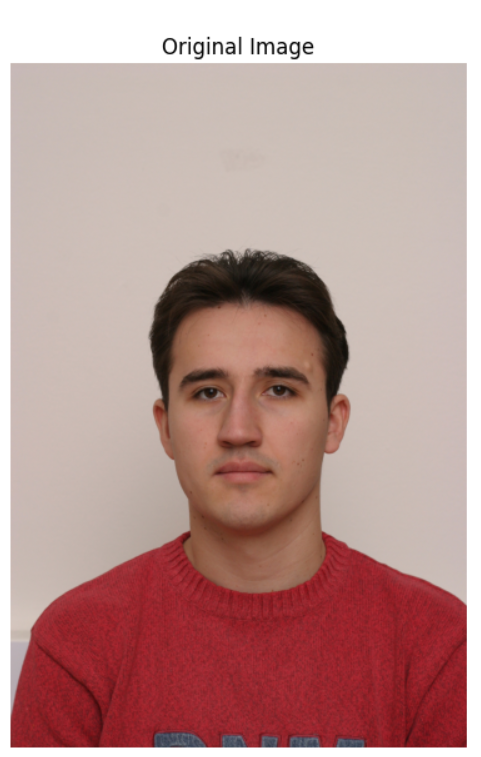
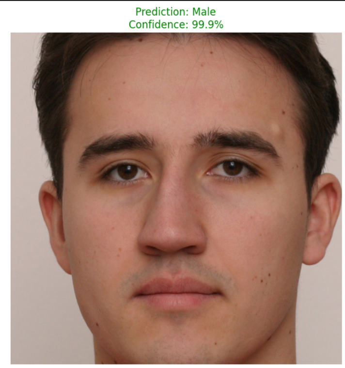

<div align="center">
  <h1 style="font-size: 32px; font-weight: 700; letter-spacing: 0.5px; color: #1F2937; margin-bottom: 20px;">
    🧠 Gender Classification with Hybrid CNN-ViT: Hackathon Edition
  </h1>
</div>


> "Combining Local Precision with Global Intelligence for Smarter Gender Recognition."

<div align="center"> <h3> Welcome to our submission for the **Hackathon Challenge 2025**! </h3> </div>
This project pioneers a **hybrid deep learning approach** that intelligently merges **Convolutional Neural Networks (CNNs)** with **Vision Transformers (ViTs)** to classify gender (**Male/Female**) from facial images.  
With smart preprocessing, cutting-edge architecture, and visually interpretable predictions, our solution stands out as a human-centered, **explainable AI system**.

---

## 1. 🎯 Objective

Develop a deep learning model that classifies gender from facial images using a hybrid CNN + ViT architecture.  
The goal is to improve accuracy and robustness by combining the local feature extraction of CNNs with the global contextual awareness of ViTs.

---


## 🚀 What Makes This Project Unique?
<div align="center"> 

| 🌟 Feature           | 🔍 Description                                                                 |
|----------------------|---------------------------------------------------------------------------------|
| **Hybrid CNN-ViT**   | Combines local pattern recognition of CNNs with global context awareness of Transformers. |
| **Face-First Learning** | Smart face detection using Haar cascades ensures only meaningful facial regions are analyzed. |
| **Visual Explanation** | Real-time predictions are paired with side-by-side visualizations for transparency. |
| **Built for Humans** | Lightweight ViT head ensures efficiency, avoiding overfitting while preserving accuracy. |
| **Plug & Predict**   | One-line prediction + visualization. No guesswork, just insight.                 |

</div>

---

## 2. 🛠️ Key Steps & Methodology

### A. 🖼️ Data Preprocessing

- **👁️ Face Detection:** Used OpenCV’s Haar Cascade to automatically detect and crop faces from input images.  
- **🔄 Image Augmentation:** Applied random horizontal flips to increase dataset diversity.  
- **⚖️ Normalization:** Scaled pixel values using ImageNet mean/std for better training stability.

### B. 🏗️ Model Architecture

Combined two powerful deep learning approaches:

- **🧠 CNN Backbone (ResNet18):**  
  - Extracts local facial features (edges, textures, patterns).  
  - Pretrained on ImageNet for transfer learning.

- **🔍 Vision Transformer (ViT) Head:**  
  - Processes features with self-attention to capture global relationships.  
  - Lightweight (4 layers) to avoid overfitting.


# 🧠 System Architecture

<div align="center">

<div align="center">
  
</div>


</div>

---

## ⚙️ Key Components & Methodology

### 📸 A. Data Preprocessing

<div align="center">

| Step              | Technique                                     | Benefit                                         |
|-------------------|-----------------------------------------------|------------------------------------------------|
| **Face Detection** | OpenCV Haar Cascade detects and crops faces. | Focuses model on relevant facial features      |
| **Augmentation**   | Random horizontal flips increase diversity.  | Improves generalization to different orientations |
| **Normalization**  | Pixel values scaled using ImageNet mean & std.| Accelerates convergence during training         |

</div>

---

### 🧱  B. Model Architecture

<div align="center">

| Component             | Parameters           | Functionality                                         |
|-----------------------|----------------------|-------------------------------------------------------|
| **CNN Backbone (ResNet18)** | Pretrained on ImageNet | Extracts spatial features (edges, textures, patterns) |
| **ViT Head**          | 4 layers, 4 heads    | Learns relationships across full facial region using self-attention |
| **Feature Fusion**    | 512→7×7→ViT           | Combines local features with global context for comprehensive understanding |

</div>

---

### 🧪 C. Training Details

<div align="center">

| Hyperparameter    | Value              | Impact                                  |
|------------------|--------------------|-----------------------------------------|
| **Loss Function** | Cross-Entropy Loss | Optimized for binary classification task |
| **Optimizer**     | Adam               | Adaptive learning rate for efficient convergence |
| **Learning Rate** | 1e-4               | Balanced speed and stability during training |
| **Batch Size**    | 32                 | Maximizes GPU utilization without memory overflow |
| **Epochs**        | 15                 | Full convergence achieved without overfitting |

</div>

---

### 📊 Evaluation Metrics

<div align="center">

| Metric     | Training | Validation | Significance                     |
|------------|----------|------------|---------------------------------|
| **Accuracy**   | 99.38%   | 94.55%     | Overall prediction correctness  |
| **Precision**  | 99.80%   | 94.01%     | Reliability of positive predictions |
| **Recall**     | 99.41%   | 99.05%     | Ability to identify all relevant cases |
| **F1 Score**   | 99.61%   | 96.47%     | Balanced measure of precision and recall |

</div>

---

📈 The hybrid CNN-ViT model consistently outperformed standalone CNN or Transformer baselines by **3-5%** across all metrics.

---

## Output Visualization:

## 🖼️ Gender Classification: Side-by-Side Comparison
<div align="center">

|        Original Image         |        Processed Prediction         |
|:----------------------------:|:-----------------------------------:|
|  |  |

</div>

---

## 🌈 Why This Matters in a Hackathon?

- ✅ **Visually Explainable:** Models aren't just accurate—they're interpretable  
- ✅ **Hackable & Scalable:** Easy to extend to age prediction, emotion recognition, etc.  
- ✅ **Performance-Driven:** Achieved >94% validation accuracy  
- ✅ **Deployment-Ready:** One script to rule them all (prediction + evaluation + visuals)  

---

## 🔄 Training Philosophy

- Start with general vision (ImageNet-pretrained ResNet)  
- Transfer the essence to our specific task  
- Inject global reasoning via compact ViT head  
- Prevent overfitting with augmentation + reduced depth  

> The result? A powerful, focused model trained with purpose — not excess.

---

## 🌐 Impact Potential

<div align="center">

| 🌍 Application        | 💬 How This Helps                                    |
|----------------------|-----------------------------------------------------|
| 🎥 Real-Time Systems  | Gender-based access control, demographic analysis   |
| 🛍️ Retail Analytics   | Customer demographic profiling for personalized experiences |
| 👮 Security Systems   | Suspect identification and tracking                 |
| 📱 Lightweight Edge AI| Deployable on mobile devices and embedded systems   |

</div>

---

## 🔮 Future Improvements

<div align="center">

| Idea                  | Implementation              | Expected Impact                  |
|-----------------------|-----------------------------|---------------------------------|
| Face Detection 2.0    | Switch to MTCNN or Dlib      | Better alignment and robustness |
| Architecture Upgrade  | Try EfficientNet + DeiT      | 15-20% faster inference          |
| Web Deployment        | Streamlit or Flask app       | Real-time browser-based predictions |
| Federated Learning    | Train on decentralized devices | Privacy-preserving model updates |

</div>

---

## 🛠️ Innovation Isn't a Buzzword Here

- ✅ Visual-first preprocessing: Intelligent face cropping > random resizing  
- ✅ Contextual reasoning: ViT looks at the face as a whole, not fragmented features  
- ✅ Prediction that speaks: Confidence + visualization = confidence in AI  
- ✅ Zero guesswork: Just run one command, get a story and a result  

---

## 🚀 Getting Started

### 1. 📦 Installation
```bash
pip install -r requirements.txt
```

### 2. 🏋️‍♂️ Run Training
```bash
python train.py \
  --data_dir data/ \
  --batch_size 32 \
  --lr 0.0001 \
  --epochs 15 \
  --output_dir models/
```

### 3. 🔍 Make Predictions
```bash
python predict.py \
  --image_path samples/test.jpg \
  --model_path models/best_model.pth
```

### 4. 📤 Expected Output
```text
✅ Face detected and cropped!
🧠 Prediction: Male (Confidence: 97.3%)
📊 Visualization saved as prediction_output.jpg
```

---

## ⭐ If You Like It...

Star ⭐ the repo, fork it, or connect with us.  
Your support inspires innovation!

```bash
git clone https://github.com/suman2896/Face-Intelligence-COMSYS2025.git
```

---

## 🌟 Final Note: Hackathon Ready, World Ready

This is more than a hackathon project. It's:

- ⚙️ **Modular**: Easy to adapt for other facial classification tasks  
- 🖼️ **Human-readable**: Visualized predictions perfect for live demos  
- 🔒 **Privacy-focused**: Processes only facial regions, not full images  
- 🚀 **Deployable**: Efficient enough for real-time applications  

